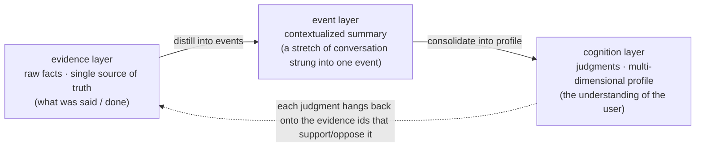
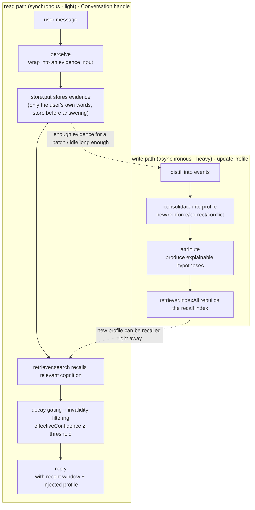
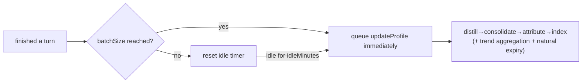
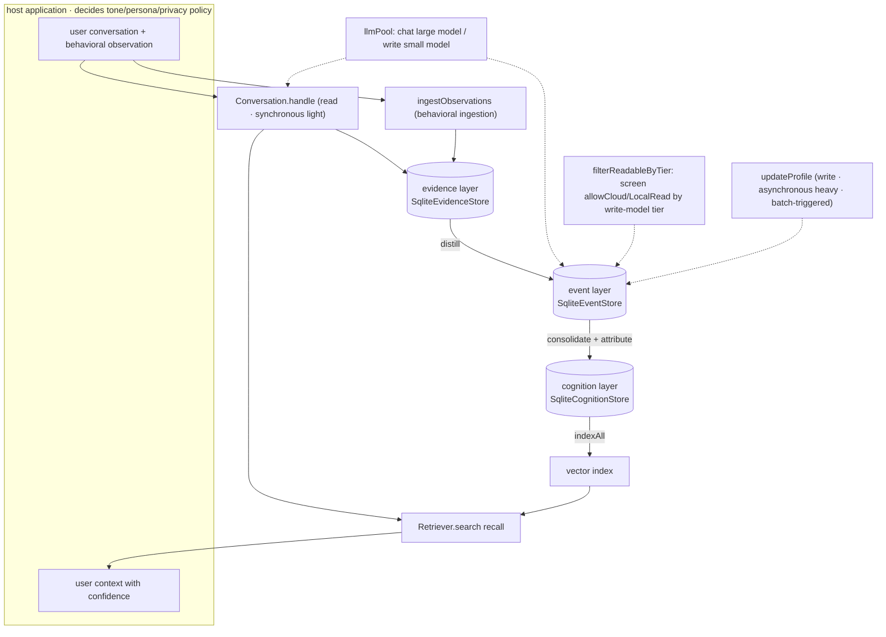

# MemoWeft Architecture Overview

> This is the **externally readable** architecture document: from the three-layer data model, to the read/write dual paths, to how cognitive discipline is put into practice, it walks through everything against the real code.
> For host integration see [integration.md](../integration.md); for the stability boundary see [memory-surface-contract.md](../reference/memory-surface-contract.md). For finer mechanism specifics (confidence algorithm, conflict closed loop, privacy authorization semantics), go straight to the source: `src/consolidation/confidence.ts`, `src/consolidation/consolidate.ts`, `src/evidence/privacy.ts`.

MemoWeft = **Memo + Weft** (the weft thread of weaving): the library threads scattered evidence, one piece at a time, into a traceable understanding of a person.

---

## 1. What it is / is not

MemoWeft is a "user cognition and context framework" that sits **outside** the LLM/Agent, taking the form of a **TypeScript library** that host applications `import`.

- **What it does**: continuously receives user-authorized conversation and behavioral evidence → settles it into cognitive assets that are [model-independent, traceable, evolvable, portable] → provides user context with confidence and boundaries when needed.
- **What it does not do**: it does not do chat/persona/UI, and it does not set tone or privacy policy on the host's behalf. Tone, persona, whether to speak up and ask, cloud versus local, whether to allow uploads to the cloud — all are decisions for the **host + user**; the library only ensures the "seams are left open and switchable."

In one line: **the library provides "the understanding of the user," the host decides "how to use that understanding."**

### 1.1 Three-layer boundary (Core / Host / Plugin)

MemoWeft uses a three-layer boundary: **Core is responsible for how memory correctly exists, Host is responsible for how the user uses and manages it, and Plugin is responsible for extension capabilities.** Core grows neither eyes nor a face; Host does not bypass Core to directly alter the underlying data; plugins can only request, Host reviews, and Core enforces the memory rules.
For "what each layer is / is not responsible for" see [boundaries.md](./boundaries.md); for plugin permissions and the hook contract see [plugin-contract.md](../plugin-contract.md).

---

## 2. The three-layer data model

The core of MemoWeft is to split "information about a person" into three layers, contextualizing and judging it layer by layer from **raw facts**, with **each layer traceable**:



The responsibility boundaries of the three layers are hard: **records are not beliefs**. evidence only stores "what the user said / did" (facts); only cognition stores "judgments about the user"; a judgment can always be traced back to the few original words it rests on.

### 2.1 evidence (evidence layer) — single source of truth

Code: `src/evidence/model.ts`, `src/evidence/store.ts`

Stores only **raw material**, no judgments (confidence / credibility status / scope of applicability are none of them at this layer). Every field is a "fact about the evidence":

| Field | Type | Meaning |
|---|---|---|
| `id` | string | Primary key (`randomUUID`) |
| `subjectId` | string | Which user's evidence |
| `sourceKind` | `'spoken' \| 'inferred' \| 'observed' \| 'tool'` | Source kind — **source-strength tiering**: spoken > inferred > observed / tool (`tool` = external tool result, AD-3) |
| `hostId` | string | Which host it came from |
| `originId` | string \| null | Original message id, **idempotent de-duplication**; has a unique index |
| `occurredAt` | string(ISO) | When the thing **actually happened** |
| `recordedAt` | string(ISO) | When MemoWeft **received and stored** it |
| `rawContent` | string | The user's original words / raw observation |
| `summary` | string | Summary for recall; v1 = `rawContent` |
| `allowLocalRead` | boolean | Whether it may be provided to a local Agent |
| `allowCloudRead` | boolean | Whether it may be sent to a cloud model (**privacy authorization bit**) |
| `allowInference` | boolean | Whether the profile/motive may be inferred from it |
| `correctsEvidenceId` | string \| null | If correcting an old record, points to the old evidence |

**Bitemporal** (borrowed from Graphiti): `occurredAt` (when it happened) and `recordedAt` (when it was stored) are separated — "played until 3:30 last night" happened last night, but may only be recorded today; both times are kept so that attribution can hew to "last night."

### 2.2 event (event layer) — contextualized summary

Code: `src/event/model.ts`, `src/event/store.ts`

An event = a "contextualized summary" of a stretch of conversation, hung back onto the original-word evidence it covers via the `event_evidence` relation table. The profile is generated from events (with context), but tracing still lands on the original-word evidence.

- `Event`: `id / subjectId / summary / occurredAt / createdAt`; `occurredAt` = the earliest occurred time among the covered evidence.
- The storage side also carries a `consolidated` flag, used for "has this event been consolidated into the profile yet" (the basis for incremental updates).
- **Red line**: the event summary contains only [the user's words + context], **not the assistant's replies** (no self-corroboration, see §4.2).

### 2.3 cognition (cognition layer) — judgments · multi-dimensional profile

Code: `src/cognition/model.ts`, `src/cognition/store.ts`

One `Cognition` is "one judgment about the user"; multiple judgments make up a multi-dimensional profile. The authorization bits are **not at this layer** (they hang on evidence); this layer stores only judgments.

| Field | Type | Meaning |
|---|---|---|
| `contentType` | `fact \| preference \| goal \| project \| state \| trait \| hypothesis \| trend` | Content type (one of many dimensions, not mutually exclusive) |
| `formedBy` | `stated \| observed \| ruled \| inferred` | Formed-by = source strength (spoken > observed > ruled > LLM inferred) |
| `confidence` | number(0~1000) | Confidence, **computed by MemoWeft, not self-reported by the LLM** |
| `credStatus` | `candidate \| low \| limited \| stable \| conflicted` | Credibility status |
| `scope` | string \| null | Applicable scenario; null = general |
| `validAt / invalidAt` | string \| null | Take-effect / expire time anchor; **mark as invalid rather than delete** (kept traceable) |
| `askedAt` | string \| null | Timestamp of proactive asking; used for "already asked, don't ask again" de-duplication |
| `archivedAt` | string \| null | Archive timestamp; non-null = archived (skipped by recall, data kept and recoverable) |

The trace chain lives in the `cognition_evidence` table: which evidence each cognition rests on to `support` or `contradict` it. This is the physical landing point for "every judgment can point to specific original words."

Two special types are worth calling out on their own:
- `hypothesis` (explainable hypothesis): a product of attribution, inferring "why" from evidence, **low confidence, hangs evidence, can be overturned**.
- `trend` (cross-session trend): a sustained pattern formed by repeatedly recurring states (e.g. "persistently low lately"), aggregated by rule based on **objective frequency** (`formedBy=ruled`), more credible than a "trait," and decays as things improve.

---

## 3. Read/write dual paths (read/write decoupling)

MemoWeft's core engineering decision: **reads synchronous and light, writes batched and asynchronous**. During chat it only does the lightweight "store evidence + recall injection"; the heavy work (digesting conversation into a profile) is batched and done slowly in the background, without blocking chat.



### 3.1 Read path (`src/pipeline/conversation.ts`)

`Conversation.handle(userMsg)` does three things per turn:

1. **Perceive → store evidence**: `perceive` wraps the user message into an `EvidenceInput` (default `spoken`), and `store.put` lands it. **Only the user's words are stored; the assistant's replies are not landed as evidence.** **Store before answering** — even if the reply fails, the evidence is already in the store.
2. **Recall relevant cognition**: `retriever.search(userMsg, topK)` finds the top-k relevant cognitions. This step **does not block the reply if it fails** (treated as no recall, answering as usual). The recall results still pass through two gates:
   - Invalidity filtering: those with a non-empty `invalidAt` (corrected/expired) are not injected, even if the index has not been rebuilt yet.
   - **Decay gating**: confidence uses **effective confidence** `effectiveConfidence` (see §4.4); those below `minEffectiveConfidence` (faded emotions, stale hypotheses) are simply not injected.
3. **Reply**: `reply` carries the recent working-memory window of a few turns (`WorkingMemory`, pure in-memory N turns) + injects the recalled profile, and makes one call to the conversation model. On injection, **confidence is made transparent to the model** ("low-confidence ones are just hypotheses, don't take them as settled").

> The read path **never writes the profile** throughout — it only reads cognition and stores raw evidence. Digesting conversation into a profile is the write path's job.

### 3.2 Write path (`src/consolidation/updateProfile.ts`)

`updateProfile` combines what were four separate steps into a single entry point (the host calls only this one), in order: `distill → consolidate → attribute → indexAll`. Each step's elapsed time is recorded into `timings`, for diagnosing "which step is slow." An index-rebuild failure **does not roll back the profile** (the index is a read-path optimization; on failure it degrades without erroring).

The four steps are detailed in §4.

---

## 4. The four write-path steps + cognitive discipline

Cognitive discipline is what MemoWeft enforces — not "record more," but "**how to record without distortion**." These disciplines run through every step of the write path.

### 4.1 Records are not beliefs (what the LLM infers starts as a low-confidence candidate)

Landing point: `src/consolidation/confidence.ts`

**Confidence is computed by MemoWeft according to rules; the LLM's self-report is never trusted.** The rules of `computeConfidence` (all parameters are in `config.ts`, calibrated once it's running):

```
confidence = base score (by formedBy) + supporting-evidence bonus (capped) − opposing-evidence penalty
```

- **Base score by formed-by** (`baseByFormedBy`): `stated:600 > ruled:450 > observed:350 > inferred:200` — LLM inference (inferred) starts lowest.
- Each additional supporting evidence `+supportStep(40)`, up to `supportCap(5)` pieces; each opposing evidence `−contradictPenalty(120)`.
- The result is clamped to `[minConfidence(50), 1000]`, always > 0.
- `deriveCredStatus` maps the score to `candidate/low/limited/stable` by threshold; any opposing evidence directly makes it `conflicted`.

**Step one distill** (`src/distillation/distill.ts`): takes the recent evidence "not yet organized into events," orders it by time, and has the write-path model summarize it into a contextualized event summary.

### 4.2 No self-corroboration (the assistant's output / the user's silence is not evidence)

Landing point: runs through the prompts and data flow of distill / consolidate / attribute.

- Only **user messages** land as evidence; the assistant's replies are never landed (`conversation.ts`: assistant replies do not enter evidence).
- distill's prompt explicitly orders "do not let the assistant's words appear, do not add speculative commentary"; the event summary contains only user content.
- In consolidate / attribute, **each cognition's support can only be chosen from the "real original-word ids fed into the prompt"** — a `validEvidence` allowlist validation; ids fabricated by the LLM are all discarded, and a candidate that cannot cite real original words is **skipped directly, not landed** ("no trace, no cognition").
- Asking (`proposeAsk`) itself does not enter evidence; only the user's **answer** is new evidence.

### 4.3 Conflicts are exposed first, never auto-resolved

Landing point: `src/consolidation/consolidate.ts`

**Step two consolidate** (into profile · incremental + counter-evidence): gives [undigested new events + existing profile] to the write-path model, judges what the new material means for the profile, and outputs four kinds of operations:

| Operation | Meaning | Handling |
|---|---|---|
| `new` | Present in the new material, absent from the profile | Add a new cognition (must have traceable original words, otherwise skip) |
| `reinforce` | New original words corroborate an existing cognition | Attach evidence, recompute confidence upward |
| `correct` | The user **explicitly corrects/negates** a cognition | Mark the old one `invalidAt` **kept-as-invalid**, adopt the new one (correction closed loop) |
| `conflict` | Contradictory but **not an explicit correction** (e.g. behavior vs. old preference) | Mark `conflicted`, **keep both, attach contradict evidence, do not replace** |

The key distinction: `correct` is the user actively clarifying → the old one gives way; `conflict` is "the observed behavior doesn't match the old preference, but the user hasn't said to change it" → **only expose the contradiction, do not decide who's right on the host's behalf**. This is the physical landing point for "conflicts are exposed first, never auto-resolved."

### 4.4 Per-type time strategy (emotions forgotten fast / explicit preferences not forgotten)

Landing point: `src/background/decay.ts` (decay) + `src/background/expire.ts` (expiry) + `confidence.ts` (transient-type cap)

Different types of cognition have different "expiry speeds" — **you can't apply a one-size-fits-all "the older, the less trusted"**:

- **Transient-type cap** (`confidence.ts`): `transientTypes` (e.g. `state`) have confidence capped at `transientCap(300)`, and in `deriveCredStatus` never reach "stable/limited" — a repeated transient emotion ≠ a stable trait, and can't grow more and more like a settled conclusion.
- **Decay at read time** (`decay.ts`): effective confidence = `confidence × 2^(−age/half-life)`, computed by the distance from the last corroboration `updatedAt`. **Computed at read time, not persisted** (the `confidence` field keeps its "evidence-strength" semantics unchanged). Half-lives (days) are split by type: `state:1.5 / hypothesis:2 / goal,project:14 / trend:7 / trait:60`; `fact/preference` are not listed = do not decay (an explicit preference is not auto-forgotten even if unmentioned for a long time).
- **Natural expiry** (`expire.ts`): only transient types expire naturally — once the distance from the last corroboration exceeds `expireAfterDays` (`state:7 / hypothesis:14 / trend:30`) they are marked `invalidAt`; stable types **never auto-expire**. Invalidation = a mark kept traceable, not a delete.

### 4.5 Attribution — explainable hypotheses, kept low

**Step three attribute (attribution)** (`src/attribution/attribute.ts`): starting from one `state` phenomenon (e.g. "didn't sleep well last night"), it pulls the evidence within the time window (including `observed` "gamed until 3:30"), has the model infer "why," and produces **explainable hypotheses**:

- Hypotheses stay hypotheses: `formedBy=inferred`, confidence capped at `hypothesisCap(250)` — **spoken quietly, not allowed to grow more and more like a settled conclusion**.
- Only attributes **recurring** phenomena (support ≥ `minPhenomenonSupport`), at most `maxPhenomenaPerRun(1)` per run (to prevent attribution explosion).
- The cause must be a **behavior / objective observation**, and **"explaining one complaint with another complaint" is forbidden** (state evidence can only be on the phenomenon side, not the cause side).
- A single hypothesis attaches at most `maxCausesPerHypothesis(2)` cause-evidence pieces; ids fabricated by the LLM are all discarded (no self-corroboration).

---

## 5. Recall

Code: `src/retrieval/`

The recall foundation is a **replaceable seam** (the `Retriever` interface), with two methods: `indexAll` (replacement-style index rebuild) + `search` (top-k). Two implementations:

- `NullRetriever`: an empty implementation — used as a fallback when no embedder is configured; `search` returns `[]` (the reply injects no profile, without erroring).
- `VectorRetriever`: SQLite stores vectors + **JS cosine similarity**, plenty for a single person's few thousand entries, **zero native dependencies** (does not use sqlite-vec). `indexAll` rebuilds by replacement; `search` embeds the query and then computes cosine to take top-k.

`Embedder` is likewise replaceable (`OpenAICompatEmbedder` calls the OpenAI-compatible `/embeddings`); when configuration is missing, `loadEmbedConfig` returns `null`, and recall automatically degrades to empty without crashing.

**The index is rebuilt by the write path**: `updateProfile`'s final step `indexAll` only indexes **non-invalidated** cognitions (corrected/expired ones are no longer recalled). The read path only does `search`, so a newly updated profile can be recalled right after the update completes.

---

## 6. Batched updates (curing "diligence")

The write path is heavy work (requiring several model calls), so it deliberately **does not block chat**: chatting records evidence, and once stopped the background digests it slowly.

- Library side: `config.profileUpdate` gives the strategy parameters `batchSize(5)` and `idleMinutes(30)`, and exposes the one-shot entry `updateProfile`.
- **Trigger scheduling belongs to the host**: the library does not run a timer itself. For a reference implementation see `scheduleBackgroundUpdate` in the testbench's `testbench/server.mjs` — **once `batchSize` new conversations have accumulated, queue an update [immediately]; otherwise reset the idle timer, and update once after being idle for `idleMinutes` with no activity, whichever comes first triggers**. Profile updates for the same user are serialized with a single lock (the same batch of events cannot be digested concurrently).



The periodic background also runs, along the way, `aggregateTrends` (cross-session trend aggregation, calling the model only when the rules screen for enough frequency) and `expire` (natural expiry of transient types).

---

## 7. Switchable parts (model seam, embedding seam, recall seam)

MemoWeft gathers all "external dependencies" into replaceable seams that the host switches as needed:

### 7.1 llmPool — switch models by purpose

Code: `src/llm/pool.ts`, `src/llm/client.ts`

Having conversation and the write path share one large model would drag each other down (the write path slows down "updating the profile"). `LLMPool` splits by **purpose**:

- `pool.for('chat')`: the conversation large model (quality first), env `MEMOWEFT_LLM_*`.
- `pool.for('write')`: the write-path small-and-fast model (saving time and money), env `MEMOWEFT_WRITE_LLM_*`; **if unconfigured it automatically falls back to chat**, same behavior as before, not forced.

`LLMClient` is an abstract interface (`chat(messages) + callCount`), and `OpenAICompatClient` uses the built-in `fetch` to call the OpenAI-compatible `/chat/completions`, **installing no SDK** (dependency stance: small and swappable). Switching models touches only this one place.

### 7.2 Dual-prefix env compatibility (conservative renaming)

Code: `readEnvWithFallback` in `client.ts` + `embedder.ts`

The brand was renamed from DLA to MemoWeft, but env reading is **dual-prefix compatible**: each key is first read as `MEMOWEFT_*`, and if not found falls back to `DLA_*`. A user's existing `.env` containing only `DLA_*` continues to work with zero changes. All nine variables follow this pattern: `MEMOWEFT_LLM_{BASE_URL,API_KEY,MODEL}`, `MEMOWEFT_WRITE_LLM_{...}`, `MEMOWEFT_EMBED_{...}`, each old name backstopped one by one.

---

## 8. Privacy / authorization bits (allowCloudRead)

Code: `src/evidence/privacy.ts`, `src/perception/ingest.ts`

Privacy (using a cloud or a local model) is a **choice of the host + user**; the library does not make security policy on the host's behalf, only ensures "the authorization bits truly take effect + a switch seam is left open."

- **Three authorization bits hang on evidence**: `allowLocalRead` (given to a local Agent), `allowCloudRead` (sent to a cloud model), `allowInference` (infer the profile from it).
- **The write path's privacy gate**: `filterReadableByTier(items, tier)` uses the current write model's tier to keep evidence that "this tier is not permitted to read" out of [the material fed to that model] (tier=cloud screens `allowCloudRead`, tier=local screens `allowLocalRead`). distill / consolidate / attribute etc. all pass through this gate before taking evidence to feed the LLM — blocked evidence neither enters the prompt nor enters the legal support set. There is also an `allowInference` gate (consistent across distill / consolidate / attribute): evidence with `inference=false` does not enter the profile, independent of tier.
- **Default values follow the configuration**: `cloudReadDefault` follows `privacyMode` (in privacy mode, defaults to not uploading to the cloud).
- **Behavioral observation is more conservative**: `observedDefaults = { local:true, cloud:false, inference:true }` — the `observed` evidence ingested by `ingestObservations` defaults to **locally readable, not uploaded to the cloud, profile-inferable**; if an `Observation` explicitly gives authorization bits, the explicit values are respected.
- **Tool results are equally conservative**: `toolDefaults = { local:true, cloud:false, inference:true }` — `tool` evidence ingested by `ingestToolResult` defaults to locally readable and not uploaded to the cloud (tool outputs often carry sensitive external data — web / file / API responses); `store.put` backstops this by `sourceKind` (`observed` and `tool` share one conservative branch). Explicit authorization bits are respected.
- **Write-model tier**: `filterReadableByTier(items, tier)` screens by the current write model's tier — declared by `MEMOWEFT_WRITE_LLM_TIER` (default `cloud`) and bound to the `LLMClient` instance; when `pool.for('write')` falls back to the chat model it inherits that model's tier. A local write model can then digest `observed` / `tool` evidence (default not uploaded) into the profile; the `allowInference` gate is consistent across distill / consolidate / attribute.

---

## 9. Behavioral perception ingestion (multi-source evidence entry)

Code: `src/perception/ingest.ts` (the general ingestion entry, belonging to Core); real collection belongs to the independent plugin package `plugins/collector-active-window/`.

Besides conversation, MemoWeft also defines "how behavioral observations come in": `ingestObservations` batch-lands the `Observation`s (`kind + occurredAt + content + optional authorization bits`) standardized by an external collector into `sourceKind='observed'` evidence, with `originId` idempotent de-duplication.

**Boundary**: Core only defines "how observations come in + how they are authorized," and **does not write "how to grab them from the operating system" inside Core** — that is the collector plugin's responsibility. Real collection (active-window sampling, the collection loop) lives in the independent plugin package `@memoweft/collector-active-window`, landed via Host `/api/observe` (Host reviews → `core.ingestObservation`), not piercing Core directly. This ensures Core itself stays clean and portable. See [the three-layer boundary](./boundaries.md) for details.

---

## 10. Storage and observability

- **Storage**: each of the three layers has one `Sqlite*Store`, and the underlying SQLite goes through a **driver seam** (`src/store/driver.ts` defines the interface, `src/store/nodeSqliteDriver.ts` eagerly selects the driver at the top level): Node ≥24 defaults to the built-in `node:sqlite` (zero third-party DB dependency), and when unavailable falls back to the optional `better-sqlite3` (`src/store/betterSqlite3Driver.ts`, which Node 20/22 needs to `npm i` to install). The default DB file is `./dla.db` (the brand was renamed but the **default DB name is not changed**, to avoid detaching from an existing data file); tests pass `':memory:'`. Old databases are automatically migrated idempotently (adding the `asked_at` / `consolidated` columns).
- **Observability**: `RunLogger` in `src/obs/runLog.ts` writes each conversation turn and each profile update (including each step's `timings`) to disk, for diagnosing "which step is slow."

---

## 11. One diagram overview


